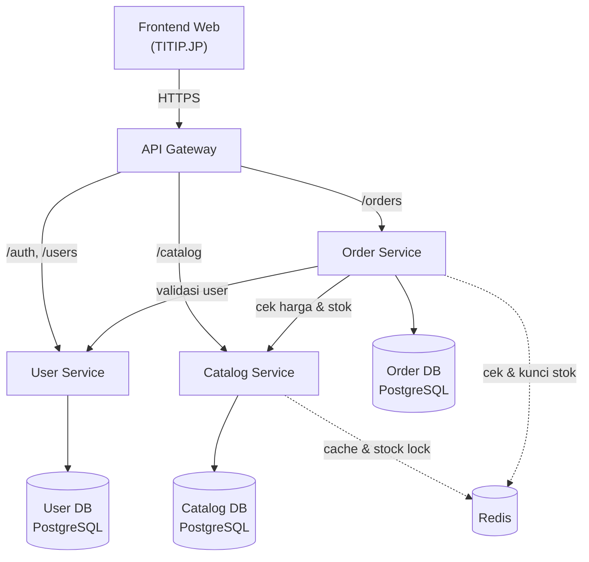
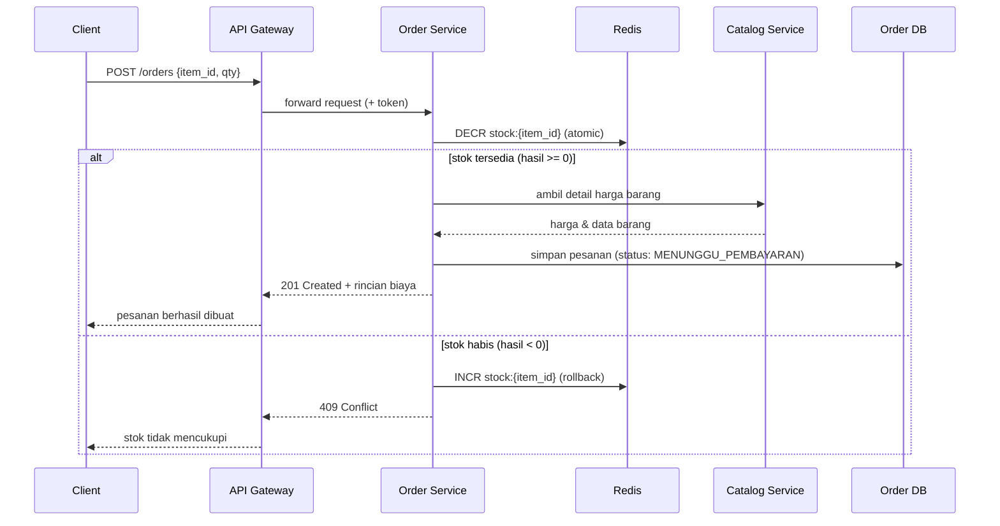
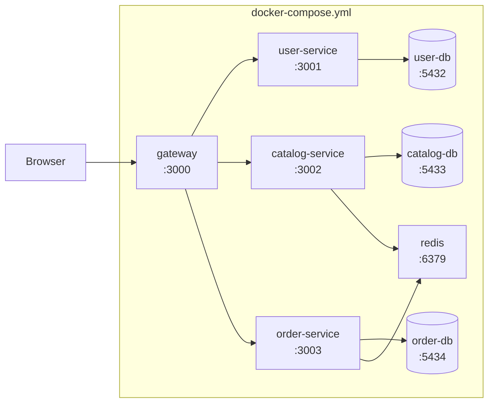

# Dokumen Arsitektur Sistem — TITIP.JP
**Peran:** Arsitek Sistem
**Proyek:** Web Jastip Jepang → Indonesia (tugas kuliah / portofolio kelompok)
**Status:** Draft v1.0

---

## 1. Ringkasan & Tujuan

TITIP.JP adalah sistem web untuk layanan jasa titip (jastip) barang dari satu negara asal (Jepang) ke Indonesia. Sistem harus mendukung katalog barang, pemesanan/permintaan titip, perhitungan biaya (harga barang + fee jasa + ongkir), serta pelacakan status pesanan — dengan stok/kuota barang yang harus konsisten meskipun diakses banyak pengguna sekaligus.

Dokumen ini mendefinisikan arsitektur yang menjadi acuan bersama untuk 4 peran lain di kelompok:
- **Backend/API Engineer** → mengimplementasikan endpoint sesuai kontrak di §9
- **Infrastructure & DevOps** → menyiapkan Docker, compose, dan gateway sesuai §10
- **Data & Persistence Engineer** → merancang skema detail & migrasi berdasarkan §8
- **QA, Load-Test & Dokumentasi** → menyusun skenario pengujian berdasarkan alur di §6 dan NFR di §11

---

## 2. Aktor & Use Case Inti

| Aktor | Use Case Utama |
|---|---|
| Pembeli (Guest/Member) | Lihat katalog, hitung estimasi ongkir, buat pesanan/request titip, lacak status pesanan |
| Admin/Jastiper | Kelola katalog & stok, konfirmasi pembayaran, ubah status pesanan (dibeli → dikirim → diterima) |
| Sistem (internal) | Menjaga konsistensi stok saat banyak pesanan masuk bersamaan |

---

## 3. ADR-001: Gaya Arsitektur

**Keputusan:** Microservices sederhana dengan API Gateway, bukan monolith.

**Alasan:**
- Selaras dengan pembagian peran kelompok — tiap service punya batas tanggung jawab yang jelas sehingga Backend Engineer, Data Engineer, dan DevOps bisa bekerja paralel tanpa saling tunggu.
- Skala kecil (3 service inti) — cukup untuk mendemonstrasikan pola sistem terdistribusi tanpa kompleksitas berlebih untuk tugas kuliah.
- Tiap service punya database sendiri (*database-per-service*), sehingga perubahan skema salah satu service tidak memengaruhi yang lain.

**Trade-off yang disadari:** ada overhead komunikasi antar-service dan kebutuhan menjaga konsistensi data lintas service (ditangani di ADR-003).

---

## 4. Komponen & Layanan

| Komponen | Tanggung Jawab |
|---|---|
| **API Gateway** | Satu pintu masuk untuk semua request dari frontend, routing ke service tujuan, autentikasi token |
| **User Service** | Registrasi, login, profil pembeli, role admin/pembeli |
| **Catalog Service** | Data barang, kategori, harga estimasi, **stok/kuota titip** |
| **Order Service** | Pembuatan pesanan, kalkulasi biaya (harga + fee + ongkir), status tracking |
| **Redis (cache & lock)** | Cache katalog, distributed lock untuk pengurangan stok saat checkout |
| **Frontend (web statis)** | UI yang sudah dibangun (`titip-jp.html`) — akan disesuaikan agar memanggil API Gateway alih-alih simulasi JS lokal |

---

## 5. Diagram Arsitektur



---

## 6. Alur Data Kunci: Pembuatan Pesanan (Cek Stok Konsisten)

Ini alur yang paling rawan *race condition* — dua pembeli menitip barang stok terakhir di waktu bersamaan. Digunakan sebagai acuan Data Engineer (skema lock) dan QA (skenario load test).



**Catatan untuk Data & Persistence Engineer:** Redis dipakai sebagai *source of truth sementara* untuk stok saat checkout (operasi atomik `DECR`/`INCR`), lalu disinkronkan berkala ke Catalog DB (PostgreSQL) sebagai *source of truth* permanen. Ini menghindari race condition tanpa perlu row-locking berat di database relasional.

---

## 7. Keputusan Teknologi Lain

### ADR-002: Stack Backend
**Keputusan:** Node.js + Express untuk semua service (konsisten dengan pengalaman kelompok di tugas sistem terdistribusi sebelumnya).
**Alasan:** Kurva belajar rendah, cocok untuk REST API sederhana, mudah di-containerize.

### ADR-003: Konsistensi Stok via Redis
**Keputusan:** Gunakan Redis `DECR`/`INCR` atomik sebagai penjaga konsistensi stok saat checkout, bukan mengandalkan transaksi database langsung.
**Alasan:** Operasi Redis single-threaded per key sehingga aman dari race condition tanpa perlu locking eksplisit di level aplikasi; latensi jauh lebih rendah dibanding row-lock di PostgreSQL untuk skenario baca-tulis cepat seperti checkout.

### ADR-004: API Gateway sebagai Single Entry Point
**Keputusan:** Semua request dari frontend wajib lewat API Gateway, service lain tidak diakses langsung dari luar.
**Alasan:** Menyederhanakan autentikasi (token divalidasi sekali di gateway), memudahkan Infra/DevOps mengatur satu titik expose port, dan memisahkan concern routing dari logika bisnis tiap service.

### ADR-005: Database per Service
**Keputusan:** User Service, Catalog Service, dan Order Service masing-masing punya database PostgreSQL sendiri.
**Alasan:** Menjaga batas tanggung jawab tiap service tetap jelas; migrasi skema satu service tidak berisiko merusak service lain.

---

## 8. Skema Data — Tingkat Tinggi

Detail kolom, index, dan constraint menjadi tanggung jawab **Data & Persistence Engineer**; berikut batas entitas per service sebagai acuan awal.

**User Service**
- `users` (id, nama, email, no_wa, password_hash, role: pembeli/admin, created_at)

**Catalog Service**
- `items` (id, nama, kategori, harga_estimasi_jpy, deskripsi, stok, created_at)
- `categories` (id, nama)

**Order Service**
- `orders` (id, user_id, item_id, qty, harga_barang_idr, fee_idr, ongkir_idr, total_idr, status, created_at)
- `order_status_log` (id, order_id, status, changed_at) — untuk histori tracking

**Redis**
- Key `stock:{item_id}` → integer stok tersedia (di-sync dari `items.stok`)

---

## 9. Kontrak API — Ringkasan Endpoint

Dipakai sebagai acuan awal Backend Engineer; skema request/response detail disepakati saat implementasi.

**API Gateway** — reverse proxy ke path berikut:

| Method | Path | Service Tujuan | Deskripsi |
|---|---|---|---|
| POST | `/api/auth/register` | User Service | Registrasi pembeli |
| POST | `/api/auth/login` | User Service | Login, kembalikan JWT |
| GET | `/api/catalog` | Catalog Service | Daftar barang (filter kategori) |
| GET | `/api/catalog/:id` | Catalog Service | Detail satu barang |
| POST | `/api/catalog` *(admin)* | Catalog Service | Tambah barang |
| PATCH | `/api/catalog/:id/stok` *(admin)* | Catalog Service | Update stok |
| POST | `/api/orders` | Order Service | Buat pesanan baru |
| GET | `/api/orders/:id` | Order Service | Detail & status pesanan |
| GET | `/api/orders?user_id=` | Order Service | Riwayat pesanan pembeli |
| PATCH | `/api/orders/:id/status` *(admin)* | Order Service | Ubah status (dibeli/dikirim/diterima) |

---

## 10. Topologi Deployment (untuk Infrastructure & DevOps)



**Ketentuan untuk DevOps:**
- Hanya `gateway` yang expose port ke luar (mis. `3000:3000`); service lain hanya diakses lewat internal Docker network.
- Tiap service + database-nya didefinisikan sebagai service terpisah di `docker-compose.yml`.
- Environment variable (koneksi DB, Redis, JWT secret) dikelola lewat file `.env` per service, jangan hardcode.

---

## 11. Kebutuhan Non-Fungsional (acuan QA & Load Test)

| Aspek | Target | Skenario Uji Terkait |
|---|---|---|
| Konsistensi stok | Tidak ada stok minus meski diakses concurrent | Load test: N request checkout bersamaan pada 1 item dengan stok terbatas |
| Waktu respons checkout | < 500ms pada beban normal | Load test bertahap (10 → 100 concurrent user) |
| Ketersediaan | Gateway tetap merespons meski satu service down | Uji matikan 1 service, cek gateway tidak crash total |
| Idempotensi | Request checkout ganda (klik dobel) tidak membuat 2 pesanan | Uji kirim request identik 2x cepat berurutan |

---

## 12. Struktur Direktori Repo (usulan)

```
titip-jp/
├── gateway/
├── services/
│   ├── user-service/
│   ├── catalog-service/
│   └── order-service/
├── frontend/
│   └── titip-jp.html
├── docker-compose.yml
├── docs/
│   ├── ARCHITECTURE.md   ← dokumen ini
│   └── adr/              ← ADR individual jika ingin dipecah per file
└── README.md
```

---

## 13. Ringkasan ADR

| ID | Keputusan |
|---|---|
| ADR-001 | Microservices + API Gateway (bukan monolith) |
| ADR-002 | Stack Node.js + Express untuk semua service |
| ADR-003 | Redis atomic DECR/INCR untuk konsistensi stok saat checkout |
| ADR-004 | API Gateway sebagai satu-satunya entry point publik |
| ADR-005 | Database per service (PostgreSQL) |

---

## 14. Langkah Selanjutnya per Peran

- **Backend/API Engineer:** implementasikan 3 service sesuai kontrak §9, mulai dari Catalog Service (paling sederhana) → User Service → Order Service (paling kompleks karena orkestrasi ke 2 service lain).
- **Infrastructure & DevOps:** siapkan `docker-compose.yml` sesuai §10, uji semua service bisa saling terhubung lewat internal network sebelum backend selesai (pakai stub/mock dulu).
- **Data & Persistence Engineer:** turunkan skema detail dari §8, siapkan script migrasi tiap service, dan implementasikan mekanisme sinkronisasi stok Redis ↔ PostgreSQL sesuai §6.
- **QA, Load-Test & Dokumentasi:** susun test case dari §11, siapkan AI-LOG dan README berdasarkan struktur di §12.
