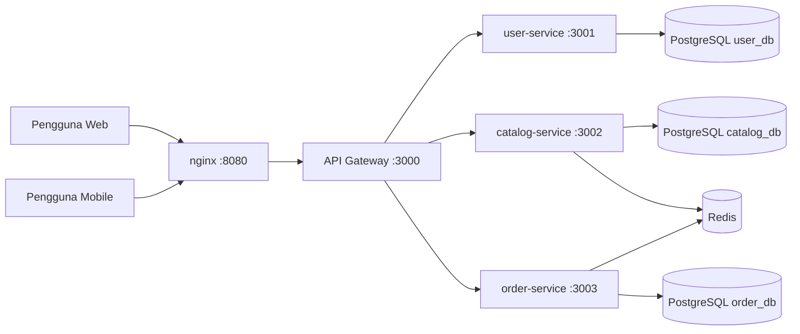
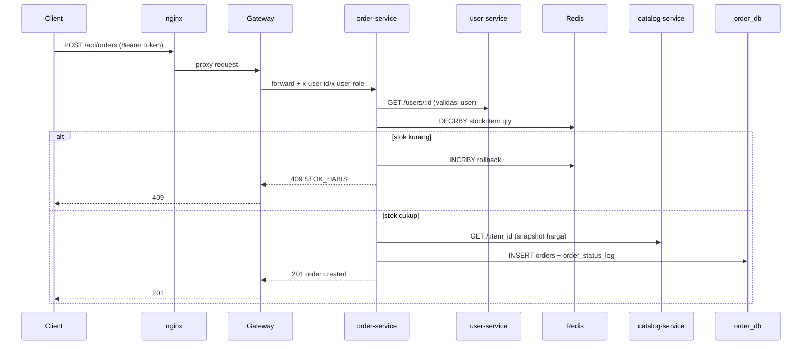

# Dokumen Arsitektur Sistem - TITIP.JP
Peran: Arsitek Sistem
Status: As-Is v2.0 (sinkron dengan implementasi repository saat ini)
Tanggal update: 2026-08-24

## 1. Ringkasan
TITIP.JP adalah sistem jastip Jepang ke Indonesia berbasis microservices dengan API Gateway dan load balancer nginx di depan gateway.

Sistem saat ini memiliki:
- Backend terpisah: user-service, catalog-service, order-service
- API Gateway untuk autentikasi dan otorisasi endpoint tertentu
- Redis untuk cache katalog dan lock stok atomik saat checkout
- Tiga database PostgreSQL terpisah (database-per-service)
- Dua klien UI: frontend web statis dan mobile app (React Native/Expo)

## 2. Scope Arsitektur
Dokumen ini mencakup:
- Arsitektur logis dan arsitektur deployment
- Alur data inti (auth, katalog, checkout)
- Kontrak antarlayanan pada level endpoint
- Batas data per service
- Keamanan, reliabilitas, dan gap integrasi saat ini

## 3. Konteks Sistem
### Aktor
- Pengguna: registrasi, login, lihat katalog, buat pesanan, lihat riwayat
- Admin: tambah/update katalog, ubah status pesanan

### Kanal akses
- Web browser ke frontend web statis
- Mobile app (Expo) ke API Gateway melalui API URL

### Diagram konteks

## 4. Komponen Inti dan Tanggung Jawab
| Komponen | Tanggung jawab |
|---|---|
| nginx | Entry point publik tunggal pada port 8080, reverse proxy ke gateway, strategi least_conn |
| gateway | Routing request, verifikasi JWT, injeksi header x-user-id/x-user-role ke upstream |
| user-service | Registrasi user, login JWT, lookup data user internal |
| catalog-service | Katalog item, kategori, stok, cache Redis, sinkronisasi key stock:id |
| order-service | Checkout, reserve/release stok Redis, idempotency key, status pesanan |
| PostgreSQL per service | Isolasi data dan skema per bounded context |
| Redis | Cache katalog dan atomic stock reservation |
| frontend web | Presentasi UI web (saat ini dominan statis/simulasi) |
| mobile app | UI mobile dengan auth context dan screen bisnis |

## 5. Keputusan Arsitektural (ADR Ringkas)
### ADR-001: Microservices + API Gateway
Dipilih untuk pemisahan domain, pembagian kerja tim, dan isolasi perubahan.

### ADR-002: Database-per-service
Setiap service memiliki PostgreSQL sendiri agar evolusi skema tidak saling mengunci.

### ADR-003: Konsistensi stok via Redis atomik
order-service memakai DECRBY/INCRBY pada key stock:id untuk mencegah race condition saat checkout concurrent.

### ADR-004: Load balancer di depan gateway
nginx dipakai sebagai lapisan ingress dan titik kontrol tunggal trafik publik.

## 6. Alur Data Utama
### 6.1 Auth flow
1. Client kirim POST /api/auth/register atau POST /api/auth/login ke gateway.
2. Gateway meneruskan ke user-service.
3. user-service memvalidasi payload, akses users table, lalu menghasilkan JWT saat login.
4. JWT dipakai pada endpoint terproteksi.

### 6.2 Catalog flow
1. Client kirim GET /api/catalog atau GET /api/catalog/:id.
2. Gateway meneruskan ke catalog-service.
3. catalog-service mencoba baca Redis cache terlebih dulu.
4. Jika cache miss, query PostgreSQL lalu set cache TTL 60 detik.

### 6.3 Checkout flow (kritis)

## 7. Kontrak API Aktual (As-Is)
### 7.1 Gateway exposed paths
- GET /health
- /api/auth/* -> user-service
- /api/catalog/* -> catalog-service
- /api/orders/* -> order-service

### 7.2 Proteksi endpoint di gateway
- POST /api/catalog: admin-only (Bearer + role admin)
- PATCH /api/catalog/:id/stok: admin-only
- PATCH /api/orders/:id/status: admin-only
- Semua /api/orders: butuh Bearer token

### 7.3 Endpoint per service (ringkas)
User-service:
- GET /health
- POST /register
- POST /login
- GET /users/:id

Catalog-service:
- GET /health
- GET /
- GET /:id
- POST /
- PATCH /:id/stok

Order-service:
- GET /health
- GET /
- POST /
- GET /:id
- PATCH /:id/status

## 8. Data Ownership
### user-service
- Table users
- Entity: identitas user, role, hash password

### catalog-service
- Table categories
- Table items
- Redis cache key catalog:list:* dan catalog:item:*
- Redis stock key stock:item_id

### order-service
- Table orders
- Table order_status_log
- Kolom idempotency_key unik untuk deduplikasi request

## 9. Deployment dan Infrastruktur
### 9.1 Topologi compose
- 1 nginx
- 1 gateway (bisa scale horizontal)
- 3 app service
- 3 PostgreSQL
- 1 Redis

### 9.2 Aturan jaringan
- Hanya nginx publish port host (8080:80)
- Semua service lain ada di internal bridge network

### 9.3 Health checks
- Semua app service expose /health
- nginx punya /health sendiri
- Compose memakai depends_on condition: service_healthy

## 10. Keamanan
- JWT verification dilakukan di gateway
- Role-based access control untuk endpoint admin
- Header user context diteruskan gateway ke upstream
- Secret masih berbasis env var; belum ada secret manager

## 11. Observability dan Operasional
Saat ini:
- Logging default stdout per container
- Health endpoint untuk liveness sederhana
- Belum ada tracing terdistribusi
- Belum ada centralized logs/metrics dashboard

Rekomendasi lanjutan:
- Tambah request correlation id end-to-end
- Tambah metrics endpoint (Prometheus format)
- Tambah dashboard observability (Grafana/Loki/Tempo)

## 12. Gap Arsitektur Saat Ini
1. Integrasi frontend web ke backend belum penuh
2. Integrasi mobile order flow belum sinkron penuh dengan kontrak order-service (butuh payload dan auth yang konsisten)
3. Belum ada object storage untuk bukti pembayaran/foto produk
4. Belum ada mekanisme refresh token
5. Belum ada API versioning formal

## 13. NFR Target yang Direkomendasikan
- Konsistensi stok: tidak boleh minus pada concurrent checkout
- p95 latency endpoint read < 300 ms pada beban normal
- p95 latency checkout < 700 ms pada beban normal
- Availability lokal demo > 99% selama sesi presentasi
- Error budget awal: 1% 5xx non-maintenance

## 14. Roadmap Arsitektur
Fase 1 (stabilisasi integrasi):
- Samakan kontrak payload frontend/mobile dengan backend
- Tegaskan auth flow (Bearer token) di semua endpoint protected

Fase 2 (hardening):
- Rate limiting di gateway
- Structured logging JSON
- Retry policy dan circuit breaker pada call antar service

Fase 3 (scalability):
- Read replica PostgreSQL untuk query-heavy flow
- Redis HA setup
- CI/CD pipeline dengan smoke test terotomasi

## 15. Mapping Struktur Repo
- gateway: API Gateway dan auth guard
- services/user-service: domain user/auth
- services/catalog-service: domain katalog/stok/cache
- services/order-service: domain order/checkout/status
- nginx: layer load balancer
- frontend: web statis
- mobile: React Native app
- docs: arsitektur dan dokumen teknis
