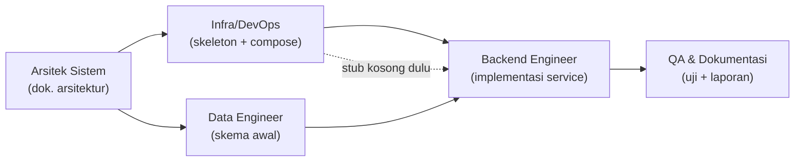

# Pembagian Tugas per Peran — TITIP.JP
**Acuan:** ARCHITECTURE.md
**Status:** Draft v1.0

Dokumen ini menurunkan arsitektur di `ARCHITECTURE.md` menjadi daftar tugas konkret per orang, termasuk urutan kerja dan dependensi antar peran — supaya semua bisa mulai kerja tanpa saling menunggu terlalu lama.

---

## 0. Urutan & Dependensi Kerja

**Prinsip pembagian waktu:**
1. **Minggu 1:** Arsitek selesai duluan (sudah beres — `ARCHITECTURE.md`). Infra & Data bisa langsung mulai paralel begitu dokumen ini dibagikan.
2. **Minggu 1–2:** Infra menyiapkan *skeleton* 3 service kosong (folder + `Dockerfile` + `docker-compose.yml`) supaya Backend Engineer punya kerangka untuk diisi, tidak perlu menunggu Infra 100% selesai.
3. **Minggu 2–3:** Backend mengisi logika di atas skeleton Infra, memakai skema dari Data Engineer.
4. **Minggu 3–4:** QA mulai uji begitu endpoint pertama (Catalog Service) jadi — tidak perlu menunggu semua service selesai.

---

## 1. Arsitek Sistem — *(kamu)*

Peran ini sudah menghasilkan dua deliverable inti; sisanya bersifat menjaga konsistensi selama implementasi berjalan.

**Sudah selesai:**
- [x] `ARCHITECTURE.md` — arsitektur, diagram, 5 ADR
- [x] `TASKS.md` — dokumen ini

**Berjalan selama proyek (bukan sekali jadi):**
- [ ] Review setiap kontrak API baru yang dibuat Backend Engineer — pastikan tetap sesuai §9 `ARCHITECTURE.md`, update dokumen jika ada perubahan
- [ ] Review skema yang dirancang Data Engineer — pastikan batas antar-service (§8) tidak dilanggar (mis. Order Service tidak boleh baca langsung ke Catalog DB)
- [ ] Buat ADR baru jika ada keputusan teknis besar yang belum tercakup (contoh: kalau tim memutuskan ganti Redis → in-memory cache, atau menambah service baru)
- [ ] Jadi penengah teknis kalau ada 2 anggota tim berbeda pendapat soal desain (mis. Backend vs Data soal siapa yang validasi stok)
- [ ] Terakhir: review keseluruhan sistem sebelum laporan akhir, pastikan implementasi nyata match dengan `ARCHITECTURE.md` — kalau ada penyimpangan, dokumen ini yang diupdate, bukan dibiarkan usang

---

## 2. Backend/API Engineer

**Urutan implementasi (dari paling sederhana):**

### 2.1 Catalog Service
- [ ] Endpoint `GET /api/catalog` — list barang + filter kategori
- [ ] Endpoint `GET /api/catalog/:id` — detail barang
- [ ] Endpoint `POST /api/catalog` (admin) — tambah barang
- [ ] Endpoint `PATCH /api/catalog/:id/stok` (admin) — update stok
- [ ] Integrasi baca dari Redis cache dulu sebelum ke Catalog DB (cache-aside pattern)

### 2.2 User Service
- [ ] Endpoint `POST /api/auth/register`
- [ ] Endpoint `POST /api/auth/login` — hasilkan JWT
- [ ] Middleware validasi JWT (dipakai ulang di Order Service)

### 2.3 Order Service (paling kompleks — kerjakan terakhir)
- [ ] Endpoint `POST /api/orders` — implementasi alur di §6 `ARCHITECTURE.md`: `DECR` stok di Redis → cek harga ke Catalog Service → simpan pesanan → rollback (`INCR`) kalau gagal
- [ ] Endpoint `GET /api/orders/:id`
- [ ] Endpoint `GET /api/orders?user_id=`
- [ ] Endpoint `PATCH /api/orders/:id/status` (admin)
- [ ] Logika kalkulasi biaya (harga barang + fee % + ongkir/kg) — reuse logika dari kalkulator di `titip-jp.html`

### 2.4 API Gateway
- [ ] Routing ke 3 service sesuai tabel endpoint §9
- [ ] Validasi token sekali di gateway (bukan diulang tiap service)

**Serahkan ke QA:** contoh request/response tiap endpoint (Postman collection atau file `.http`) begitu satu service selesai — jangan tunggu semua service kelar.

---

## 3. Infrastructure & DevOps

### 3.1 Fase awal (paralel dengan Arsitek, sebelum Backend mulai)
- [ ] Buat struktur folder repo sesuai §12 `ARCHITECTURE.md`
- [ ] `Dockerfile` untuk tiap service (`user-service`, `catalog-service`, `order-service`, `gateway`) — boleh masih kosong/stub isi endpoint dummy dulu
- [ ] `docker-compose.yml` sesuai topologi §10: 4 service app + Redis + 3 database, network internal, hanya gateway yang expose port ke luar
- [ ] File `.env.example` per service (jangan commit `.env` asli)

### 3.2 Fase implementasi (paralel dengan Backend)
- [ ] Setup Redis container + volume persist (opsional untuk demo)
- [ ] Setup 3 container PostgreSQL terpisah dengan volume masing-masing
- [ ] Pastikan health check antar service (`depends_on` + `healthcheck` di compose)
- [ ] Uji `docker compose up` end-to-end setelah Backend mengisi service satu per satu

### 3.3 Fase akhir
- [ ] Dokumentasikan cara menjalankan sistem (`docker compose up -d`) — masuk ke README bersama QA
- [ ] Siapkan skrip reset data demo (`docker compose down -v && docker compose up`) untuk kebutuhan presentasi

---

## 4. Data & Persistence Engineer

### 4.1 Skema detail (turunan dari §8 `ARCHITECTURE.md`)
- [ ] Rancang tabel `users` lengkap (kolom, tipe data, constraint, index unik di `email`)
- [ ] Rancang tabel `items` & `categories` lengkap (index di `kategori`, `stok >= 0` check constraint)
- [ ] Rancang tabel `orders` & `order_status_log` lengkap (foreign key logis antar service — ingat: tidak ada FK fisik lintas database, hanya disimpan sebagai ID referensi)

### 4.2 Migrasi
- [ ] Setup tool migrasi (mis. `node-pg-migrate` atau Prisma Migrate) per service
- [ ] File migrasi awal (`create_users_table`, `create_items_table`, dst)
- [ ] Seed data contoh (barang skincare/snack/fashion/koleksi dari katalog frontend yang sudah ada)

### 4.3 Konsistensi Stok (kolaborasi erat dengan Backend Engineer)
- [ ] Definisikan skema key Redis `stock:{item_id}` dan cara inisialisasi nilainya dari `items.stok` saat service start
- [ ] Buat mekanisme sinkronisasi berkala Redis → PostgreSQL (job sederhana, mis. tiap perubahan berhasil langsung `UPDATE items SET stok = ...`)
- [ ] Dokumentasikan skenario edge case: apa yang terjadi kalau Redis restart dan datanya hilang (rencana pemulihan dari PostgreSQL)

---

## 5. QA, Load-Test & Dokumentasi

### 5.1 Pengujian fungsional (mulai begitu Catalog Service jadi)
- [ ] Test case per endpoint di §9 `ARCHITECTURE.md` (happy path + error case, mis. stok habis → harus 409)
- [ ] Test alur penuh: registrasi → login → lihat katalog → buat pesanan → cek status

### 5.2 Load Test (acuan §11 `ARCHITECTURE.md`)
- [ ] Skenario N request checkout bersamaan pada 1 barang stok terbatas — pastikan stok tidak pernah minus
- [ ] Ukur waktu respons checkout pada beban 10 / 50 / 100 concurrent user
- [ ] Uji idempotensi — kirim request checkout identik 2x berurutan cepat, pastikan tidak jadi 2 pesanan
- [ ] Uji ketahanan — matikan salah satu service, pastikan Gateway tidak ikut down total

### 5.3 Dokumentasi
- [ ] **AI-LOG** — catat penggunaan AI selama proyek (prompt penting, apa yang di-generate, apa yang diedit manual)
- [ ] **README.md** — cara install & jalankan (`docker compose up`), struktur folder, ringkasan arsitektur (boleh rujuk `ARCHITECTURE.md`)
- [ ] **Laporan akhir** — kumpulkan hasil load test, screenshot pengujian, dan status akhir tiap fitur dari checklist role lain

---

## 6. Checklist Integrasi Akhir (semua peran)

- [ ] `docker compose up` berjalan tanpa error dari kondisi bersih
- [ ] Alur penuh pembeli bisa dijalankan dari frontend `titip-jp.html` sampai backend
- [ ] Semua ADR di `ARCHITECTURE.md` masih sesuai dengan implementasi akhir
- [ ] README, AI-LOG, dan laporan akhir sudah lengkap
